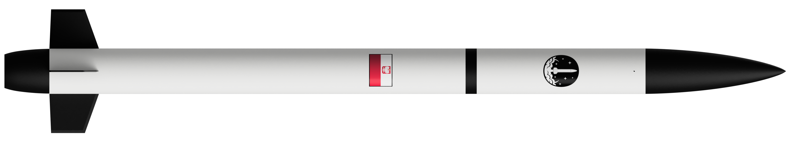
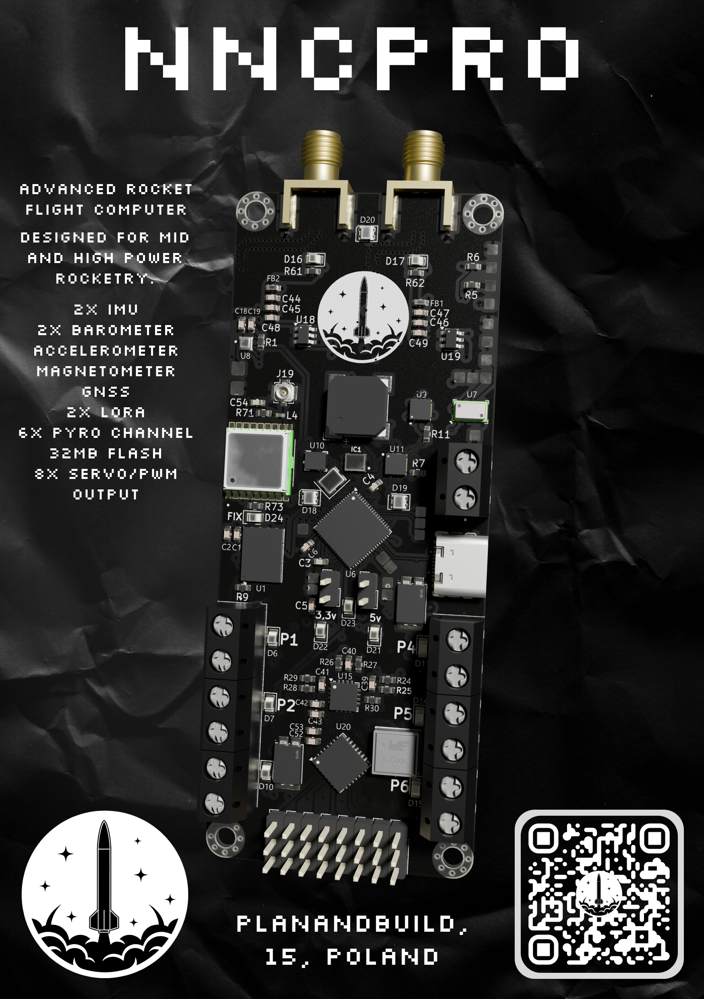

  

---

<h1 align="center">NNCpro</h1>

<h3 align="center">AKA NoNameComputer 2.0</h3>

 <small><I>Built for sky.<I></small>

  <b>NNCpro is a fligth computer designed mainly for rockets but it also can be used for other vehicles.</b>
   
  <b>It is designed to collect data from all of the sensor, sending it IRL back down to the earth via radio link, deploy parachutes, steer rocket in flight using aerodynamic control or TVC and at the end send live location. </b>
   
  <em>I have designed it for my rockets because there is no comercial computers or if there is something it's very expensive. I actually like designig electronics and thats why I'm even here.</em>

## Features

**8x Servo outputs** ***(PWM channels)***

**6x Pyrotechniacal channels** ***(used for firing parachute charges, motor ignitions etc.)***

**Long-Range radio** ***(based on two LoRa modules for simultaneous transmiting and reciveing)***

**Current and Voltage sensing** ***(based on INA3221 three channel current sensor)***

**Audio signaling** ***(using passive buzzer with possibility of modulation sound wave)***

**Flash memory for storing software and flight data in flight**

**micro-SD card slot for saving fligth data after landing**

**3,3v and 5v power supply**

**ARGB LEDs for signaling computer states**

---
## Sensors
| Sensor Type | Primary Component |
| :--- | :--- |
| **Barometer main** | `MS5611` (High precision) |
| **Barometer secondary** |`BMP390` (Redundant) |
| **Inertail Mesurment Unit main**| `LSM6DSV80XTR` (6-DoF Main) |
| **Inertail Mesurment Unit secondary** |`LSM6DSO32XTR` (6-DoF Secondary) |
| **High-G Acceleration** | `H3LIS200DLTR` (Up to $\pm200\text{g}$) |
| **Magnetometer** | `MMC5983MA` (3-axis Compass) |
| **GNSS (GPS)** | `u-blox MAX-M10M-20b` |
---
## Images

<table align="center" border="0" cellpadding="0" cellspacing="0">
  <tr>
    <td>
      
    </td>
    <td>
      
    </td>
  </tr>
</table>

### schematics:

 

  
  
  
  
  
  

 
## ⚖️ License

This project is licensed under the **Creative Commons Attribution-NonCommercial-ShareAlike 4.0 International (CC BY-NC-SA 4.0)** License.

[![CC BY-NC-SA 4.0][cc-by-nc-sa-shield]][cc-by-nc-sa]

You are free to share and adapt this material under the following terms:
* **Attribution** — You must give appropriate credit to the original author.
* **NonCommercial** — You may not use the material for commercial purposes.
* **ShareAlike** — If you remix, transform, or build upon the material, you must distribute your contributions under the same license.

## BOM
| Item No. | Qty | Value | Manufacturer Part Number (MPN) | Supplier Part Number | Unit Price | Total Price |
| :---: | :---: | :--- | :--- | :--- | :---: | :---: |
|   | **--- CAPACITORS ---** |   |   |   |   |   |
| 1 | 1 | 10nF | 0603X7R103K250NT | [C49326603](https://www.lcsc.com/product-detail/C49326603.html) | $0.0034 | $0.0034 |
| 2 | 33 | 100nF | FCC0603B104K500CT | [C5137636](https://www.lcsc.com/product-detail/C5137636.html) | $0.0147 | $0.4851 |
| 3 | 5 | 1uF | CL10B105KA8NNNC | [C29936](https://www.lcsc.com/product-detail/C29936.html) | $0.0218 | $0.1090 |
| 4 | 2 | 2.2uF | CL10A225KO8NNNC | [C23630](https://www.lcsc.com/product-detail/C23630.html) | $0.0093 | $0.0186 |
| 5 | 1 | 4.7uF | CL10A475KO8NNNC | [C19666](https://www.lcsc.com/product-detail/C19666.html) | $0.0227 | $0.0227 |
| 6 | 5 | 10uF | CL10A106MA8NRNC | [C96446](https://www.lcsc.com/product-detail/C96446.html) | $0.0532 | $0.2660 |
| 7 | 5 | 22uF | CL10A226MP8NUNE | [C86295](https://www.lcsc.com/product-detail/C86295.html) | $0.0380 | $0.1900 |
| 8 | 4 | 47uF | CL21A476MRYNNNE | [C377776](https://www.lcsc.com/product-detail/C377776.html) | $0.0542 | $0.2168 |
|   | **--- RESISTORS ---** |   |   |   |   |   |
| 9 | 3 | 0.03Ω | YLRY06-1-30F | [C20608713](https://www.lcsc.com/product-detail/C20608713.html) | $0.0390 | $0.1170 |
| 10 | 13 | 10Ω | 1RC0603J0100 | [C54531635](https://www.lcsc.com/product-detail/C54531635.html) | $0.0012 | $0.0156 |
| 11 | 7 | 220Ω | HRC0603F2200ENTN | [C54920883](https://www.lcsc.com/product-detail/C54920883.html) | $0.0011 | $0.0077 |
| 12 | 1 | 560Ω | GR0603J560RT5G00 | [C49653272](https://www.lcsc.com/product-detail/C49653272.html) | $0.0008 | $0.0008 |
| 13 | 1 | 1kΩ | FRC0603F1001TS | [C2907002](https://www.lcsc.com/product-detail/C2907002.html) | $0.0023 | $0.0023 |
| 14 | 2 | 4.7kΩ | HRC0603J472 ENTN | [C54921051](https://www.lcsc.com/product-detail/C54921051.html) | $0.0010 | $0.0020 |
| 15 | 2 | 5.1kΩ | RTT035101FTP | [C103686](https://www.lcsc.com/product-detail/C103686.html) | $0.0012 | $0.0024 |
| 16 | 30 | 10kΩ | FRC0603F1002TS | [C2906982](https://www.lcsc.com/product-detail/C2906982.html) | $0.0023 | $0.0690 |
| 17 | 2 | 15kΩ | SCR0603J15K | [C3017711](https://www.lcsc.com/product-detail/C3017711.html) | $0.0009 | $0.0018 |
| 18 | 1 | 30kΩ | CL0603JN30KP | [C49254202](https://www.lcsc.com/product-detail/C49254202.html) | $0.0011 | $0.0011 |
| 19 | 1 | 42.2kΩ | RS-03K4222FT | [C321903](https://www.lcsc.com/product-detail/C321903.html) | $0.0006 | $0.0006 |
| 20 | 10 | 100kΩ | CL0603JN100KP | [C46635231](https://www.lcsc.com/product-detail/C46635231.html) | $0.0011 | $0.0110 |
| 21 | 1 | 110kΩ | CL0603FN110KP | [C48996812](https://www.lcsc.com/product-detail/C48996812.html) | $0.0012 | $0.0012 |
| 22 | 1 | 135kΩ | RT0603BRD07135KL | [C861113](https://www.lcsc.com/product-detail/C861113.html) | $0.0284 | $0.0284 |
| 23 | 1 | 330kΩ | GR0603J330KT5G00 | [C49656714](https://www.lcsc.com/product-detail/C49656714.html) | $0.0008 | $0.0008 |
|   | **--- INDUCTORS / CHOKES ---** |   |   |   |   |   |
| 24 | 2 | 27nH | LQG15HS27NJ02D | [C12669](https://www.lcsc.com/product-detail/C12669.html) | $0.0282 | $0.0564 |
| 25 | 1 | 680nH | 7443934450068 | [710-7443934450068](https://www.mouser.pl/ProductDetail/Wurth-Elektronik/7443934450068) | $1.8700 | $1.8700 |
| 26 | 1 | 1.5uH | AFE201612S1R5MBT | [C41347749](https://www.lcsc.com/product-detail/C41347749.html) | $0.0389 | $0.0389 |
|   | **--- DIODES / TRANSISTORS ---** |   |   |   |   |   |
| 27 | 6 | ZMM3V0-TD | ZMM3V0-TD | [C46550821](https://www.lcsc.com/product-detail/C46550821.html) | $0.0064 | $0.0384 |
| 28 | 7 | DO2300B | DO2300B | [C41367404](https://www.lcsc.com/product-detail/C41367404.html) | $0.0190 | $0.1330 |
| 29 | 12 | LED RED | GL0805UR01 | [C51933307](https://www.lcsc.com/product-detail/C51933307.html) | $0.0046 | $0.0552 |
| 30 | 1 | SI1016CX-T1-GE3 | SI1016CX-T1-GE3 | [C727293](https://www.lcsc.com/product-detail/C727293.html) | $0.9442 | $0.9442 |
| 31 | 3 | SP15100L | SP15100L | [C20199370](https://www.lcsc.com/product-detail/C20199370.html) | $0.1170 | $0.3510 |
| 32 | 3 | WS2812B-2020 | XL-0807RGBC-2812B-S | [C41413181](https://www.lcsc.com/product-detail/C41413181.html) | $0.0345 | $0.1035 |
|   | **--- INTEGRATED CIRCUITS (ICs) ---** |   |   |   |   |   |
| 33 | 2 | 74LVC2G04LT06ARCQ | 74LVC2G04LT06ARCQ | [C46527078](https://www.lcsc.com/product-detail/C46527078.html) | $0.0404 | $0.0808 |
| 34 | 1 | BMP390L | BMP390L | [828-BMP390TR-ND](https://www.digikey.pl/en/products/detail/bosch-sensortec/BMP390/16164575) | $3.3000 | $3.3000 |
| 35 | 2 | E220-400M22S | E220-400M22S | [C2971737](https://www.lcsc.com/product-detail/C2971737.html) | $2.7215 | $5.4430 |
| 36 | 1 | H3LIS200DLTR | H3LIS200DLTR | [497-15698-2-ND](https://www.digikey.pl/en/products/detail/stmicroelectronics/H3LIS200DLTR/5268010) | $8.4000 | $8.4000 |
| 37 | 1 | INA3221 | INA3221AIRGVR | [C181255](https://www.lcsc.com/product-detail/C181255.html) | $1.4247 | $1.4247 |
| 38 | 1 | LSM6DSO32 | LSM6DSO32 | [497-LSM6DSO32XTR-ND](https://www.digikey.pl/en/products/detail/stmicroelectronics/LSM6DSO32XTR/14291421) | $4.8900 | $4.8900 |
| 39 | 1 | LSM6DSV80XTR | LSM6DSV80XTR | [497-LSM6DSV80XTR-ND](https://www.digikey.pl/en/products/detail/stmicroelectronics/LSM6DSV80XTR/26371340) | $6.5100 | $6.5100 |
| 40 | 1 | LT6000CDCB#TRMPBF | LT6000CDCB#TRMPBF | [C672644](https://www.lcsc.com/product-detail/C672644.html) | $3.3445 | $3.3445 |
| 41 | 1 | MAX-M10M-20B | MAX-M10M-20B | [672-MAX-M10M-20BTR-ND](https://www.digikey.pl/en/products/detail/u-blox/MAX-M10M-20B/28314774) | $7.5600 | $7.5600 |
| 42 | 1 | MMC5983MA | MMC5983MA | [C404329](https://www.lcsc.com/product-detail/C404329.html) | $2.2672 | $2.2672 |
| 43 | 1 | MS5611 | MS5611-01BA | [C15639](https://www.lcsc.com/product-detail/C15639.html) | $7.1145 | $7.1145 |
| 44 | 1 | NC7WZ07P6X | NC7WZ07P6X | [C95342](https://www.lcsc.com/product-detail/C95342.html) | $0.0564 | $0.0564 |
| 45 | 1 | PCA9685BS | PCA9685BS | [C5191634](https://www.lcsc.com/product-detail/C5191634.html) | $4.4014 | $4.4014 |
| 46 | 1 | STM32H562RIVx | STM32H562RIV6 | [497-STM32H562RIV6-ND](https://www.digikey.pl/en/products/detail/stmicroelectronics/STM32H562RIV6/21348982) | $7.3400 | $7.3400 |
| 47 | 1 | TPS564242DRLR | TPS564242DRLR | [296-TPS564242DRLRTR-ND](https://www.digikey.pl/en/products/detail/texas-instruments/TPS564242DRLR/16585669) | $0.5800 | $0.5800 |
| 48 | 1 | TPS56C230RJER | TPS56C230RJER | [C1849534](https://www.lcsc.com/product-detail/C1849534.html) | $0.5300 | $0.5300 |
| 49 | 1 | W25Q512JVE | W25Q512JVEIQ | [C2986165](https://www.lcsc.com/product-detail/C2986165.html) | $6.7941 | $6.7941 |
|   | **--- CONNECTORS ---** |   |   |   |   |   |
| 50 | 2 | Conn_01x02_Pin | 2.54mm Header 2pin | [Numer](Link) | | |
| 51 | 8 | Conn_01x03_Pin | 2.54mm Header 3pin | [Numer](Link) | | |
| 52 | 2 | SMA_Connector | HL-SMA-KHDC5T | [C19712117](https://www.lcsc.com/product-detail/C19712117.html) | $2.9083 | $5.8166 |
| 53 | 1 | U.fl_Connetor | 5001-RF00001-03R1-00 | [C48689029](https://www.lcsc.com/product-detail/C48689029.html) | $0.0338 | $0.0338 |
| 54 | 1 | MLD-TF PUSH-H18 | MLD-TF PUSH-H18 | [C52750848](https://www.lcsc.com/product-detail/C52750848.html) | $0.0421 | $0.0421 |
| 55 | 7 | Screw_Terminal_01x02 | KF301-2P | [C474881](https://www.lcsc.com/product-detail/C474881.html) | $0.1008 | $0.7056 |
| 56 | 1 | USB_C_Receptacle_USB2.0_16P | F32258MUBCE2O | [C5917305](https://www.lcsc.com/product-detail/C5917305.html) | $0.3052 | $0.3052 |
|   | **--- MISCELLANEOUS ---** |   |   |   |   |   |
| 57 | 6 | 500mA | CF06V5TR50 | [C163116](https://www.lcsc.com/product-detail/C163116.html) | $0.0386 | $0.2316 |
| 58 | 3 | 600ohm | CBG160808U601T | [C73326](https://www.lcsc.com/product-detail/C73326.html) | $0.0113 | $0.0678 |
| 59 | 1 | Buzzer | YX-SMD8530P | [C781886](https://www.lcsc.com/product-detail/C781886.html) | $0.3755 | $0.3755 |
| 60 | 1 | Crystal_GND24 | F32258MUBCE2O | [C5917305](https://www.lcsc.com/product-detail/C5917305.html) | $0.3052 | $0.3052 |
|   | **--- ADDITIONAL ELEMENTS ---** |   |   |   |   |   |
| 61 | 4 | Screws | Any M3 screw |  |  |  |
| 62 | 1 | PCB Board | 4layer PCB | [JLCPCB](https://jlcpcb.com/) | $7.0000 | $7.0000 |
|   |   |   |   |   |   |   |
| **SUMMARY** | | | | | | **Total: $90.28** |

[cc-by-nc-sa]: http://creativecommons.org/licenses/by-nc-sa/4.0/
[cc-by-nc-sa-shield]: https://img.shields.io/badge/License-CC%20BY--NC--SA%204.0-lightgrey.svg
